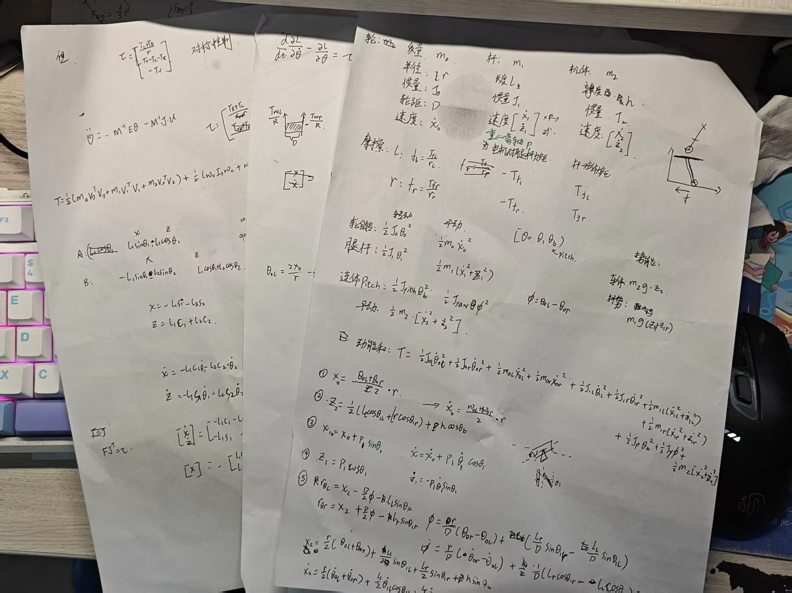
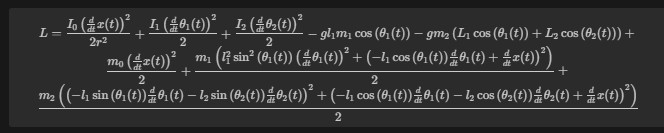
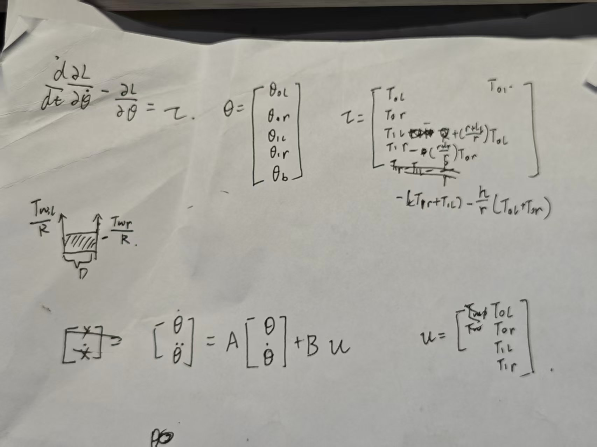

# 双轮足机器人
摘要
本文围绕双轮足机器人课设中负责的 模型预测控制（MPC）、运动学与动力学建模、电机驱动与控制、传感器驱动与信号处理\底层控制系统(表情识别) 展开设计与实现。通过建立机器人运动学 / 动力学模型、设计 MPC 算法、开发电机与传感器接口交互及构建实时底层系统，实现了机器人的稳定自平衡、轨迹跟踪及人机表情交互功能。测试结果表明，各模块协同工作良好，为双轮足机器人的自主运动与智能交互提供了技术支撑。

## 运动学与动力学建模(保底控制方案,如果强化学习sim2real无法成功就用它完成双轮组机器人的控制)
- 系统建模

- 得到拉格朗日函数
- 然后代入拉格朗日方程便可把theat dot表达出来建立状态空间方程如下
- 然后就拿这个状态空间方程用LQR做最优化就完事了

## 电机驱动与控制
- 根据结构力学的分析,搭妙4310与4340的最大扭矩满足双轮足机器人的需求.
- 根据达妙官方的数据手册的寄存器数据和通信协议完成电机位置速度力矩信息的获取与控制信号下发
- 因为考虑髋关节的控制,mpc算法就会变得非常的复杂,所以这里直接通过pid算法将髋关节锁住

## 传感器驱动,信号处理(滤波)
- 根据BMI088的数据手册完成寄存器的读写获取三轴陀螺仪与三轴加速度计的数据信息通过获取到的角加速度信息与加速度信息计算出机器人实时的位姿(通过互补滤波稳定位姿的输出)
- 但是直线加速度的剔除需要更复杂一点的逻辑,暂时没弄

## PC与主控
- 电脑跑ros,单片机选用stm32h723
- 一开始想了好几版方案的,因为成本有限,没办法购置miniPC完成强化学习的端侧部署,所以选择PC跑强化学习然后与机器人通信的方案
- 通信考虑两种方案,一种将单片机的can分一路出来与电脑通信
  - 电脑的信号通过usb2can转换器转成can信号完成通信(1Mhz)
  - 和单片机直接使用低速usb外设进行通信(7.5Mhz)
- 若通信速率满足强化学习模型控制需求,通过wifi对控制信号进行转发,完成信号的无线传输,否则就用一根超长usb线完成控制

## 表情识别探索
- 考虑到用户与机器人交互式,如果只靠单纯语音内容,交互的方式就会很单调,所以尝试让ai通过(面部表情识别+语音语调情绪识别)情绪识别获取用户的实时情绪说不定就能为用户提供跟多的情绪价值,驱动机器人完成多模态情感反馈闭环
- 面部表情识别
  - 基于FER2013数据集搭建CNN卷积神经网络,实现73%准确率的7类表情分类
- 语音语调情绪识别
  - 重点构建通用语音情感表征模型emotion2vec。通过自监督蒸馏框架提取50Hz帧级情感特征。  (同样也是7分类)   
